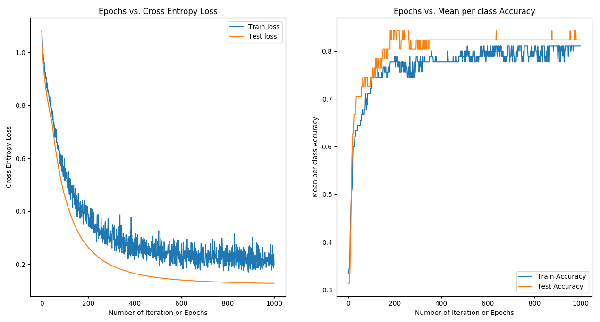
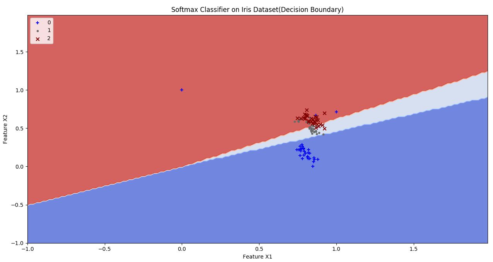
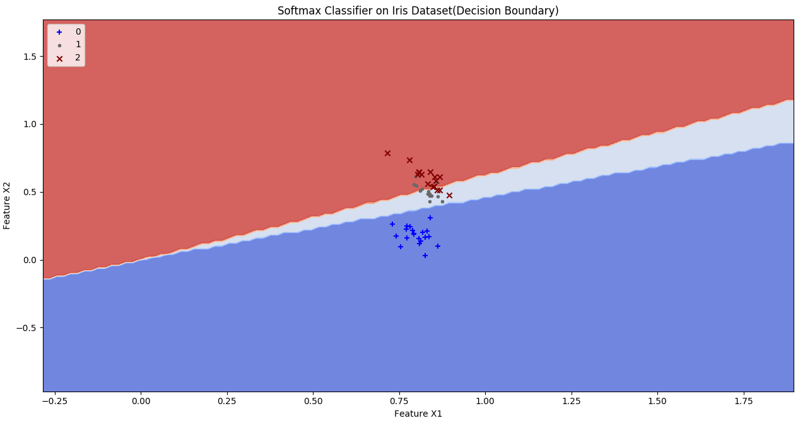
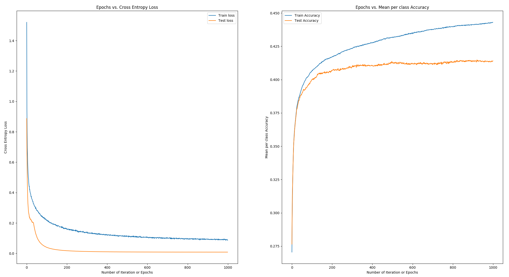
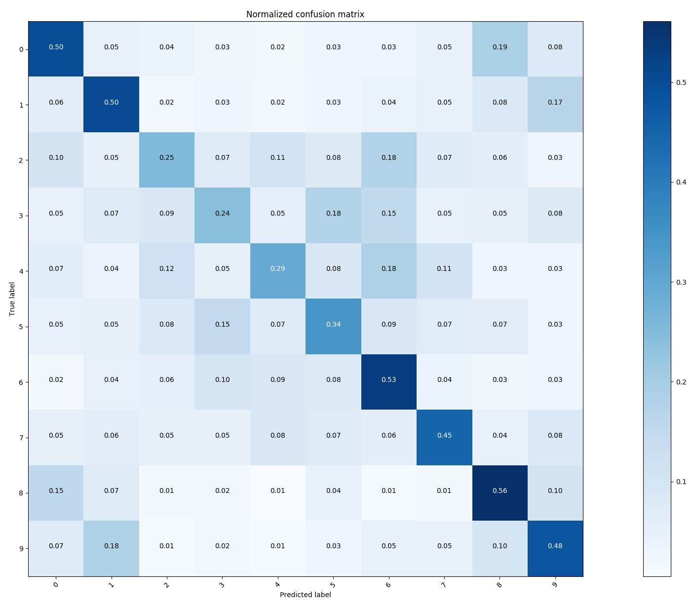

# Implementation of Softmax Classifier

### Problem Statement:

Implementation of Softmax Classifier on Iris and CIFAR-10 dataset.

### Description:

Softmax Regression also called as *Multinomial Logistic, Maximum Entropy Classifier, or Multi-class Logistic Regression* is a generalization of logistic regression that we can use for multi-class classification under the assumption that the classes are mutually exclusive. In contrast, we use the (standard) Logistic Regression model in binary classification tasks.

Below is the perceptron diagram:


Here, softmax was used as an **activation function** which allows us to interpret the outputs as probabilities.


**Cross Entropy loss** is use to measure the error at a softmax layer.


Implemented a Softmax classifier with **L_2 weight decay regularization**. Regularization is used to prevent overfitting in neural nets. When training neural networks, it is common to use "weight decay," where after each update, the weights are multiplied by a factor slightly less than 1. This prevents the weights from growing too large, and can be seen as gradient descent on a quadratic regularization term.


where, the regularization parameter lambda determines how you trade off the origin loss L with the large weights penalization and 'w' is the coefficient of the weight matrix.

I have also used **stochastic gradient descent with mini-batches** and **momentum** to minimize softmax (cross-entropy) loss of this single layer neural network. 

**Mini-batch gradient** descent is a trade-off between stochastic gradient descent and batch gradient descent.  In mini-batch gradient descent, the cost function (and therefore gradient) is averaged over a small number of samples, from around 10-500.  This is opposed to the SGD batch size of *1* sample, and the BGD size of all the training samples. The benefit of using mini-batches is that it smooths out some of the noise in SGD, but not all of it, thereby still allowing the “kick” out of local minimums of the cost function.  Also, the mini-batch size is still small, thereby keeping the performance benefits of SGD. The **momentum** is used to get better converge rates on deep networks. A model can easily get stuck in a local minima and the algorithm may think you reach the global minima leading to sub-optimal results. To avoid this situation, we use a momentum term in the objective function, which is a value between 0 and 1 that increases the size of the steps taken towards the minimum by trying to jump from a local minima.

------

### Dependencies:

- Python 3.5+
- Numpy
- Matplotlib
- pickle

### Execution of Program:

Run Softmax classifier on Iris dataset as:

```powershell
python softmaxClassifier.py
```

```shell
python softmaxClassifier.py -lr 0.07 -e 1000 -bs 10 -r 0.001 -m 0.05
```

If you want to run Softmax classifier on CIFAR-10 dataset:

```powershell
python softmaxWithCIFAR10.py
```

```shell
python softmaxWithCIFAR10.py -lr 0.01 -e 100 -bs 200 -r 0.001 -m 0.005
```

where,

| Parameter | Details                                  |
| --------- | ---------------------------------------- |
| -lr       | Learning rate or step size **\*[Default: 0.07]***** |
| -e        | Number of epochs **\*[Default: 1000]***** |
| -bs       | Number of sample in mini-batches**[Default: 10]** |
| -r        | L2 weight decay regularization lambda value**[Default: 0.001]** |
| -m        | A momentum value**[Default: 0.05]**      |


### Output:

1. #### Iris Dataset:

   ```python
   HYPERPARAMETERS:
   Epochs: 1000
   Learning Rate: 0.07
   Batch size: 10
   Regression Strength: 0.001
   Momentum: 0.05

   MEAN-PER CLASS ACCURACY:
   Training Accuracy: 0.81
   Testing Accuracy: 0.83
   ```

   

   - ##### Train Dataset:



- ##### Test Dataset:



1. #### CIFAR-10 Dataset:

   The CIFAR-10 dataset contains 60,000 RGB images from 10 categories. Download it from here: 

   https://www.cs.toronto.edu/~kriz/cifar.html

   Download [CIFAR-10 python version](https://www.cs.toronto.edu/~kriz/cifar-10-python.tar.gz) , extract it and save under the directory where softmaxWithCIFAR10.py file location. CIFAR-10 dataset contains data_batch\_1, data_batch\__2, data_batch\_3, data_batch\_4, data_batch\_5, test_batch.

   ##### Sample Images:

   

   ```powershell
   HYPERPARAMETERS:
   Epochs: 1000
   Learning Rate: 0.001
   Batch size: 200
   Regression Strength: 0.0001
   Momentum: 0.005

   MEAN-PER CLASS ACCURACY:
   Training Accuracy: 0.44
   Testing Accuracy: 0.41
   ```

   

   

As we can see, the single neuron softmax classifier model is not strong enough to learn higher dimensional features and hence the accuracy comes in 40's.
